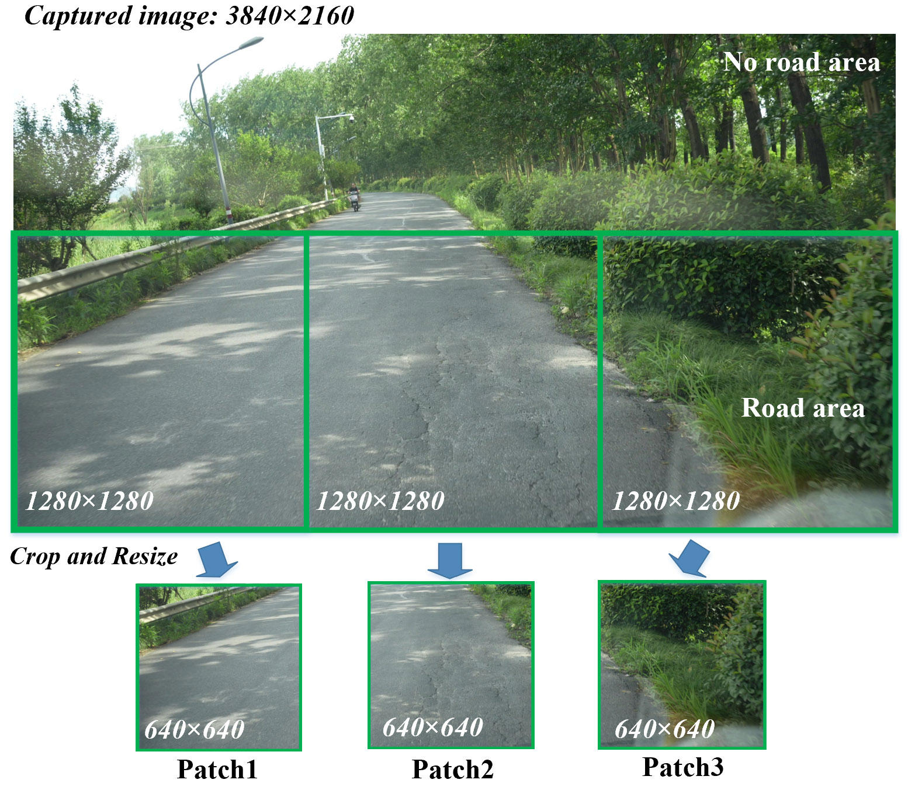

# HRCrack4K: A High-Resolution On-Board Road Crack Segmentation Dataset

**HRCrack4K** is a large-scale, high-resolution benchmark for **pixel-level road crack segmentation from vehicle-mounted (on-board) cameras**. It accompanies our paper:

> **On-Board Road Crack Inspection via Adaptation of the Segment Anything Model**

Unlike existing crack benchmarks captured from close-range, nadir (top-down) views, HRCrack4K provides **forward-facing oblique-view imagery** acquired from in-service vehicles, introducing realistic challenges such as perspective distortion, scale variation, complex background clutter, and variable illumination. This repository also hosts the official implementation of **SAMENet**, our SAM3-based segmentation framework.

---
<p align="center">

</p>

## Highlights

- **2,226** high-resolution (4K, 3,840 × 2,160) crack-containing images with **pixel-level binary annotations**
- **6,678** non-overlapping road-region patches ready for training and evaluation
- Full-frame mirrorless cameras (Sony Alpha 7 IV / Alpha 9 III, FE 35 mm f/1.8 prime lens), recorded in **XAVC S-I 4K** with intra-frame coding to minimize compression artifacts

## Comparison with Existing On-Board Crack Datasets

| Dataset | Scene Type | Resolution | Capture Devices | Images |
|---|---|---|---|---|
| AIMCrack | city roads | 1,920 × 1,080 | Black-box cameras | 527 |
| EdmCrack600 | urban and rural roads | 1,920 × 1,080 | GoPro Hero7 | 600 |
| CrackSeg | freeways and highways | 3,840 × 2,160 | Not reported | 3,540 |
| **HRCrack4K (Ours)** | urban and rural roads | 3,840 × 2,160 (full-frame sensor) | Sony Alpha 7 IV / Alpha 9 III | **2,226** |

## Data Acquisition

Imagery was collected by a fleet of four vehicles (one sedan and three commercial vans), each equipped with a Sony Alpha 7 IV or Alpha 9 III full-frame mirrorless camera and an FE 35 mm f/1.8 prime lens, under two mounting configurations:

## Preprocessing and Splits

1. A fixed-size Region of Interest (ROI) encompassing the primary road surface is extracted from each 3,840 × 2,160 frame to suppress non-road distractors (sky, buildings, ego-vehicle hood).
2. Each road ROI is cropped into **three non-overlapping patches** (6,678 patches in total).
3. For the experiments in the paper, patches are resized to **640 × 640** at training/inference time.

The dataset is partitioned into training, validation, and test sets in a **70:15:15** ratio, **stratified by camera-mounting configuration**:
| Split | Source Images | Patches |
|---|---|---|
| Train | 1,558 | 4,674 |
| Validation | 334 | 1,002 |
| Test | 334  | 1,002 |

## Directory Structure

```
HRCrack4K/
├── train/
│   ├── images/          
│   └── masks/          
├── valid/
│   ├── images/
│   └── masks/
├── test/
    ├── images/
    └── masks/
```

[Download HRCrack4K Dataset](https://drive.google.com/file/d/1bi4_ncqx7vcuo-XZqH7pUi6DzbgT8CQ7/view?usp=drive_link)

Please open an issue if the link becomes unavailable.

The HRCrack4K dataset is released for **non-commercial academic research only** under the [CC BY-NC 4.0](https://creativecommons.org/licenses/by-nc/4.0/) license. <!-- TODO: confirm/replace with your intended license -->

## Citation

If you find HRCrack4K or SAMENet useful in your research, please cite:

```bibtex
@article{chen2026samenet,
  title   = {On-Board Road Crack Inspection via Adaptation of the Segment Anything Model},
  author  = {Chen, Hanshen and Wang, Xianbao},
  year    = {2026},
  note    = {under review}
}
```

